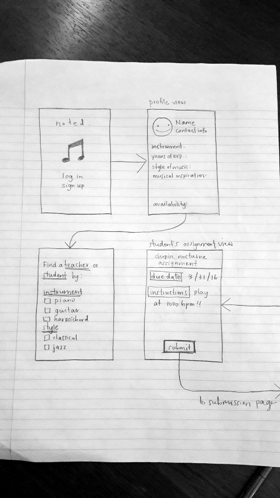
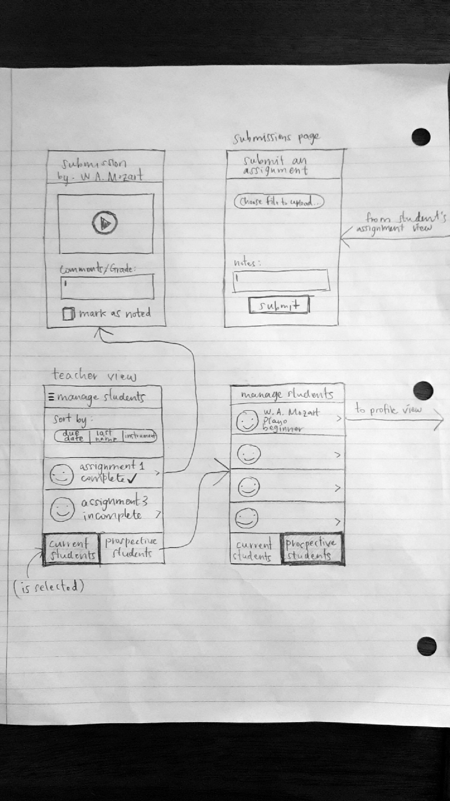
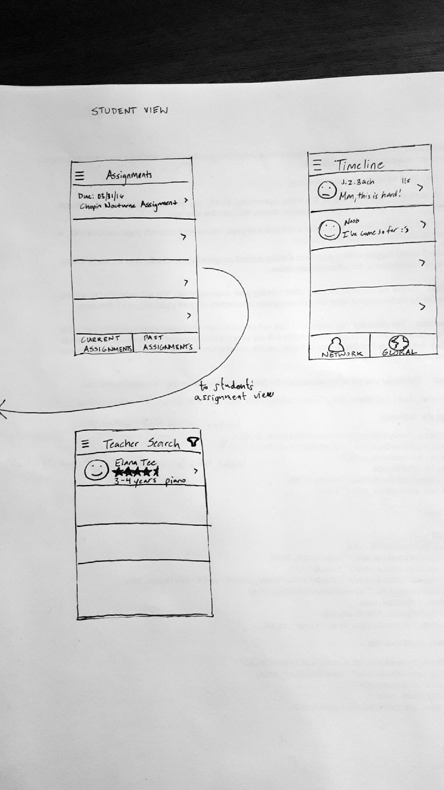

# noted
an app that brings out the musician in everyone - connecting experienced musicians to individuals motivated to learn music

# user stories

## required
- [ ] teachers can create assignments for students to complete
- [ ] students can complete assignments by sumbitting audio recordings
- [ ] teachers can respond to student submissions with comments
- [ ] teachers can view detailed assignment page
- [ ] students can view detailed assignment page
- [ ] teachers can view list of past and current assignments
- [ ] students can view list of past and current assignments

## optional
- [ ] students and teachers can create user profiles detailing:
   - [ ] years of experience
   - [ ] instruments 
   - [ ] styles of music
   - [ ] inspirational musicians
   - [ ] availability
- [ ] search filters for finding students/teachers based on profile details
- [ ] home timeline showing other users's posted status updates
- [ ] algorithm that matches students to teachers
- [ ] chart that shows student progress
   - [ ] style
   - [ ] technique
- [ ] connect to facebook for friend activity
- [ ] students can upload link to youtube videos for assignment submission

# wireframe mockup

